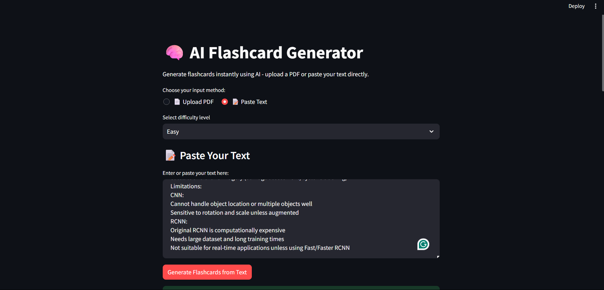
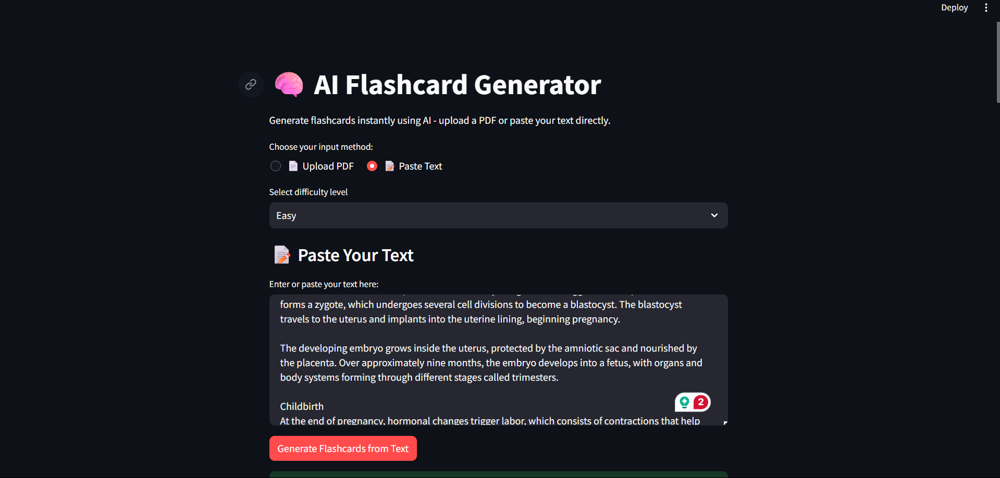
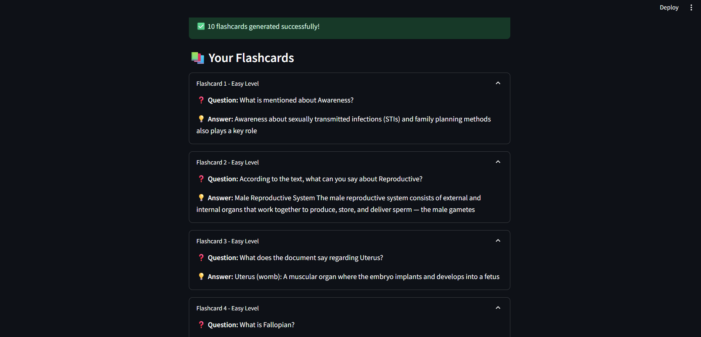
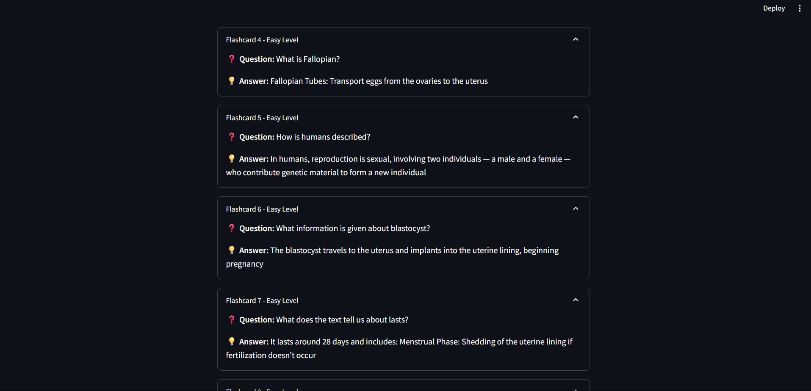
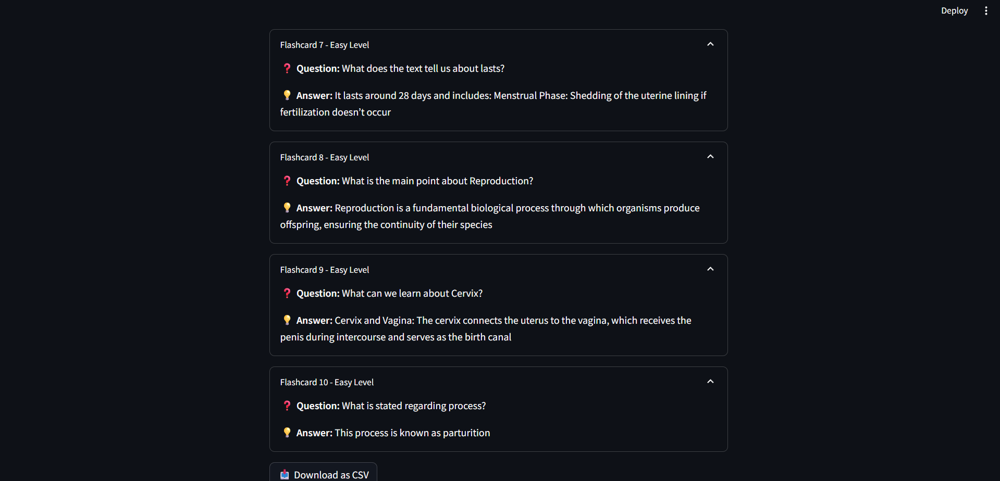
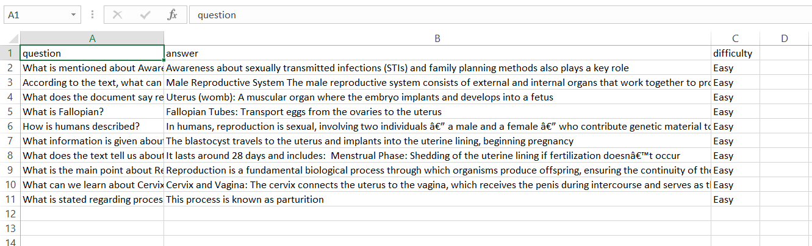

# AI-FlashCard-Generator

AI FlashCard Generator
An intelligent flashcard generation system that creates study cards from any text input using AI models or rule-based algorithms. Perfect for students, educators, and anyone looking to create effective study materials quickly.
🚀 Features

AI-Powered Generation: Uses transformer models (DialoGPT, Phi-1.5, DistilGPT2) for intelligent flashcard creation
Fallback System: Automatically switches to rule-based generation if AI models aren't available
Multiple Difficulty Levels: Easy, Medium, and Hard difficulty settings
Batch Generation: Creates 10 flashcards per session
Smart Content Processing: Extracts key concepts and generates relevant questions
Flexible Input: Works with any text content - articles, notes, textbooks, etc.

📋 Requirements

Python 3.7 or higher
PyTorch
Transformers library
CUDA support (optional, for faster AI processing)

🛠️ Setup
1. Clone the Repository
bashgit clone https://github.com/rishabh1911007/AI-FlashCard-Generator.git
cd AI-FlashCard-Generator
2. Create Virtual Environment
bash# Create virtual environment
python -m venv venv

# Activate virtual environment
# On Windows:
venv\Scripts\activate

# On macOS/Linux:
source venv/bin/activate
3. Install Dependencies
bashpip install torch torchvision torchaudio
pip install transformers
pip install numpy
Or if you have a requirements.txt file:
bashpip install -r requirements.txt
4. Verify Installation
bashpython flashcard_generator.py
You should see output indicating whether the AI model loaded successfully or if it's using simple generation.

📖 Usage
### 📋 How to Use:
1. **Choose your input method** - Upload a PDF or paste text directly
2. **Select difficulty level** - Easy, Medium, or Hard
3. **Generate flashcards** - Click the button to create your study cards
4. **Review and download** - Expand each flashcard to review, then download as CSV

### 💡 Tips:
- For PDFs: Make sure your PDF contains selectable text (not just images)
- For text input: Include at least 50 characters for meaningful flashcards
- The AI will generate 3-5 flashcards based on your content
- Higher difficulty levels create more analytical questions

# Output Image

